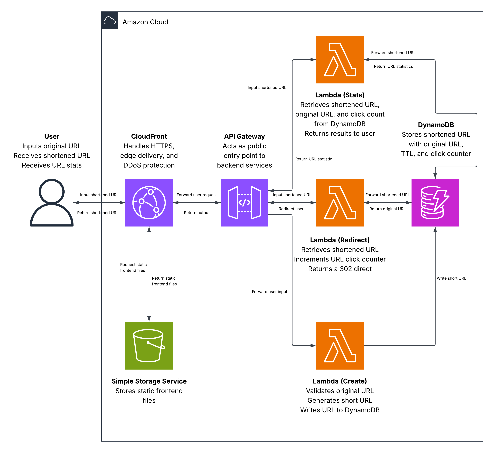

## AWS Serverless URL Shortener

A fully serverless URL shortener built on AWS, designed to convert long URLs into short, shareable links that fit comfortably in small spaces and on mobile screens. Built primarily to deepen understanding of DynamoDB and multi-service AWS architecture, with a focus on data integrity, atomic operations, and edge delivery.

## Live Demo

https://d3hohcnfpufdrr.cloudfront.net/

## Architecture

## AWS Services Used

- AWS Amplify – Frontend hosting with automatic CI/CD on push
- Amazon CloudFront – Global edge delivery and HTTPS termination
- Amazon API Gateway – Public-facing REST API with throttling and burst rate limits
- AWS Lambda – Backend logic across three functions (Python)
- Amazon DynamoDB – Short code and URL storage
- Amazon S3 – Static asset storage

## Request Flow 
### Creating a Short URL

1. The user submits a long URL and an optional custom alias via the frontend
2. API Gateway forwards the request to Lambda
3. Lambda checks DynamoDB for an existing alias — if taken, the user is prompted to choose another
4. Lambda performs a conditional write, only inserting the item if the short code does not already exist
5. The short URL is returned to the frontend

### Request Flow - Redirect

1. The user visits a short URL
2. CloudFront forwards the request to API Gateway, which triggers the redirect Lambda
3. Lambda retrieves the item from DynamoDB and manually checks whether it has expired
4. If valid, Lambda returns a 302 redirect to the original URL and atomically increments the click counter
5. If expired or not found, Lambda returns an appropriate error response

## Design Decisions

- DynamoDB over RDS - short codes map to long URLs naturally as key-value pairs; DynamoDB's partition key design and atomic operations are a direct fit
- Conditional writes - duplicate prevention happens atomically in DynamoDB rather than in a read-check-write cycle, closing the race condition window
- 302 over 301 - 301s are permanently cached by browsers, bypassing Lambda on repeat visits and breaking analytics and expiry enforcement
- Manual TTL check in Lambda - DynamoDB's built-in TTL can lag up to 48 hours; a timestamp check in Lambda ensures expired links never redirect
- CloudFront - edge delivery reduces redirect latency globally and provides DDoS protection and HTTPS termination out of the box
- Optional custom alias - users can supply a 6-character slug; if taken, they're prompted to retry; otherwise a random code is generated
- API Gateway throttling - burst rate limits at the API layer prevent abuse and protect DynamoDB from request floods

## Key Learnings

- DynamoDB atomic operations close race condition gaps - early on, the assumption was that Lambda would read an item, process it, and write back. Understanding that DynamoDB can perform conditional reads and writes as a single indivisible operation was a significant shift. It moves the integrity check into the database layer where it belongs
- DynamoDB TTL is not instant - TTL marks items for deletion when their timestamp passes, but physical removal can lag by up to 48 hours. A manual expiry check in the redirect Lambda is necessary to prevent expired links from remaining active during that window
- Environment variables must be exact across every function - with three separate Lambda functions sharing configuration like table names and region, a single typo in an environment variable causes silent failures that are harder to trace than code errors. Consistent naming conventions matter more than expected
- Reading DynamoDB output correctly takes adjustment - early errors came from misreading the structure of DynamoDB responses rather than misconfiguring the table. Once the response format was understood, parsing became straightforward and predictable

## What I Would Do Next

- Authentication via Amazon Cognito - allow users to create accounts, manage their own links, and view personal analytics
- Click analytics dashboard - surface click count data over time rather than just a running total, using the existing counter as a foundation
- QR code generation - automatically generate a scannable QR code for every short URL, since short links and QR codes serve the same use case
- URL validation and blocklisting - ensure URLs are valid and reject known malicious or inappropriate domains before storing them
- Enhanced rate limiting - supplement API Gateway throttling with per-IP controls to prevent a single user from flooding the table with short codes
- Custom domain - replace the CloudFront-generated domain with a short custom domain to make the shortened URLs genuinely compact

## Contact

Open to internship and graduate opportunities in software engineering and cloud computing.

- Email: nevenspooner03@gmail.com
- LinkedIn: https://www.linkedin.com/in/neven-spooner/
